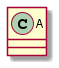
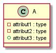
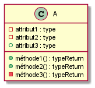
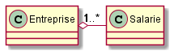
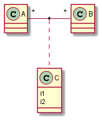

# Diagramme-de-classe

## Définitions

### Cas d'utilisations
- Ce sont les fonctionnalitées attendues du système à concevoir d'un point de vue d'un utilisateur

### Classes
- Ce sont les concepts métiers du domaine d'activité que l'on souhaite développer 
- Les classes sont reliées entre elles : les objets communiquent entre eux

### Représentation d'une classe

- Plusieurs granularités possibles

    - Classe simple 
    
    
    
    - Classe avec attribut 
    
    
    
    - Classe avec attribut et méthodes
     
     

## Types d'associations
- Association simple
    - Bidirectionnel
    
    
    - Unidirectionnel
    
    

- Agrégation

    
    
- Composition (TODO)
    
    
    
- Héritage

    
    
- Association porteuse d'information

    
    
    - Les cardinalitées sont à * - *
    - La classe C est une classe d'association
    
    
